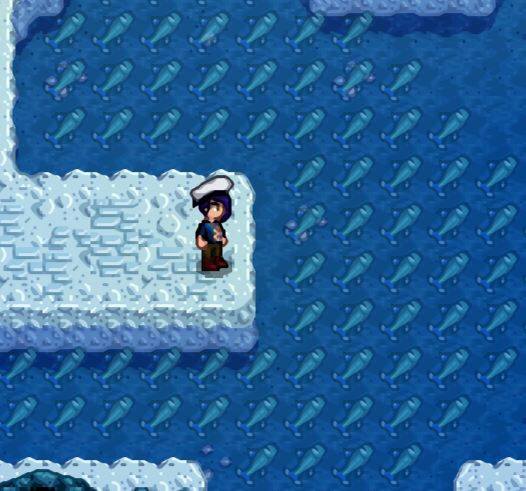
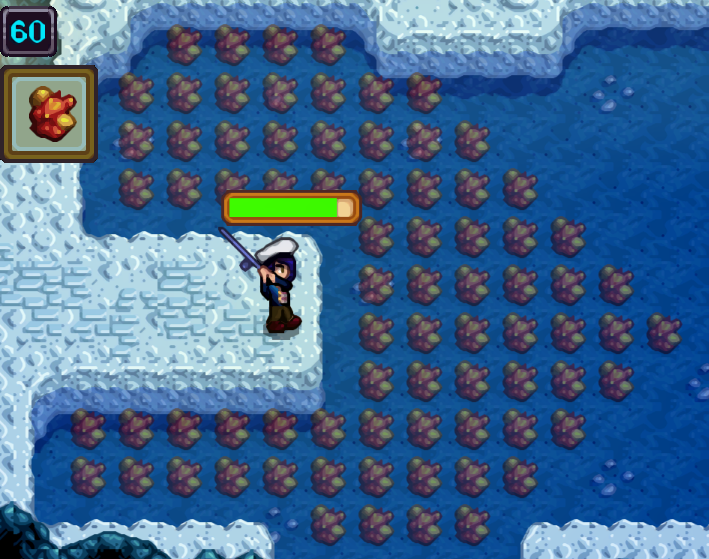

# A Fishing Sea

(Say it quickly.)


## Introduction

> *"Arrr, sometimes I wonder why I bother plunderin' at all."*
>     -- Captain Horatio McCallister

Stardew's fishing is actually a great mechanic. It's one of the few minigames available throughout the game in which your planning, coordination and overall skill as a _player_ can make a big difference. Version 1.6 added new mechanics to make fishing even more useful, well into the mid-game period.

The only problem is, once you've gotten the hang of it, it becomes boring and frustratingly unpredictable, not because of the minigame itself, but because of all the waiting, trial-and-error, day-restarts and weird RNG around it. For some of us, at least, the worst aspect of starting a new run/playthrough is having to do the days upon days -- both in-game and real time -- of fishing all over again.

You could cheat, maybe use an instant-bite/instant-catch mod, but that would be throwing the baby out with the bathwater... or the fish out with the seawater. What if we could (mostly) preserve the game's balance, and just bump it a little farther up the skill-luck axis? That's what AFS (A Fishing Sea) is all about.

The core [features](#features) of AFS include:

- [Informative splash points](#improved-bubbles) (AKA "[fishing bubbles](https://stardewvalleywiki.com/Fishing#Bubbles)"): See how much time is left before those bubbles disappear, and where and when the next ones will appear.
- [Catch predictions](#predictable-catches): See what you're about to catch, before you cast your line. These are **true predictions**, not "distribution info/statistics" about what you _might_ catch. Don't waste your precious tackle and targeted bait!
- [Jelly predictions](#jelly-countdowns) with countdown: Know when you can score those rare sea/cave jellies, and combine with catch predictions to be able to reliably score multiple jellies in a single in-game day without having to save-scum.
- [Fishing timescale](#fishing-timescale): Watch the minutes and NPCs fly by as you wait for a bite. This is a no-cheat solution to fishing boredom; it takes exactly the same number of in-game minutes to get a bite -- i.e. based on your bait, tackle, bubbles, etc. -- but game time will run up to 10x faster, so it feels nearly instant to you. Time automatically slows back to normal speed once a fish bites, so you can react quickly enough to start the minigame and don't actually waste any time.
- [Balance and progression](#balance-progression): Choose from one of three built-in difficulty settings or customize your own.

## Installation

A Fishing Sea follows the standard installation procedure for most mods:

1. Install SMAPI and set up your game for mods, per the [Modding: Player's Guide](https://stardewvalleywiki.com/Modding:Player_Guide/Getting_Started) instructions.
2. Download the [latest release](https://github.com/focustense/StardewFishingSea/releases). Make sure you download the `FishinC x.y.z.zip` file, **not** the source code.
3. Open the .zip file and extract the `FishinC` folder into your `Stardew Valley\Mods` folder.
4. Launch the game!

## Features

Most of AFS's features are predictive in some way, except for [timescaling](#fishing-timescale). Note that predictions must be turned on via the "Overlay Hotkey" in order to see anything. If you prefer, you can also [configure](#configuration) the mod to turn predictions on automatically when you load a game.

### Improved Bubbles

> *"Ah, the exact center of the Atlantic Ocean. This seems the logical place for fish to congregate!"*
>     -- Prof. Hubert J. Farnsworth

[Fishing bubbles](https://stardewvalleywiki.com/Fishing#Bubbles), internally called "splash points", cause fish to bite 4 times faster. This is immensely useful in the early game, when you cannot use spinners and might not have access to high-quality bait (or any bait at all), and when you are trying to level-up your fishing skill. However, the location and duration of these splash points is randomized, and to maximize catches/profits, you must consider whether the extra catches from one will be worth the time to walk back and forth and possibly have lower-quality catches.

This is all fine and good, but the game gives no indication of how long any spot will last; there might be less than an hour left, and it's gone by the time you get there. On the other hand, a "lucky" spot could last half a day or even more. This information is 100% predetermined and can be easily viewed in tools like the [Map Predictor](https://www.nexusmods.com/stardewvalley/mods/6614), but without using offline tools and/or restarting the day several times, there was no way to clearly visualize this within the game and make smart tactical decisions -- until now.

| Current Bubbles | Future Bubbles |
| :-: | :-: |
|  |  |

AFS can show you how much in-game time is remaining (in green/red) on an active splash spot, and also where the next spot will appear (in blue). Note that "future splashes" are only shown when there is no "current splash". This UI is designed to give you just enough information to adapt quickly to changing circumstances but still preserve a bit of spontaneity and pleasant surprise -- or unpleasant, if the next splash spot turns out to be on an unreachable tile.

### Predictable Catches

Stardew 1.6 introduced a certain type of fishing tackle that is widely regarded as useless, as its "prediction" is only available once you have already hooked the fish. However, even if it worked as was probably intended, and as some clever [mods](https://www.nexusmods.com/stardewvalley/mods/24837) have managed to implement, it still involves casting about and hoping for good luck. What if you could actually see _before_ casting, and be aware of the differences between tiles? Now you can.

|                        Waterfall Fish                        |                   The Elusive Ice Pip                   |
| :----------------------------------------------------------: | :-----------------------------------------------------: |
|  |  |

Sometimes it is more than just regions or the current state of the RNG; there may even be differences between tiles in the same area:


AFS does not create this variation, which already exists in the game; it simply makes it visible to you, so that you can make informed decisions about where to cast from, and how far. Maximum casts aren't always the best option if you're trying to catch a specific fish!

> [!NOTE]
>
> Catch previews are only visible when using a fishing rod. It must be in your inventory *and* selected.

### Freezing and Respawn

> *"Well now, that is the dangdest thing -- this is the same fish I just threw back!"*
>     -- Hank Hill

A Fishing Sea provides some important options to control "respawning" of fish.

The vanilla behavior is actually continuous respawn; that is, the fish you will catch can literally change from frame to frame, as the outcome is not decided until you hook something. AFS makes this predictable, but in order to be predictable, it must "hold" the frame-to-frame randomness so that its results remain constant for some period of time.

In other words, while AFS intentionally does not affect the _logic_, or the overall _distribution_ of fish in a given location, it puts itself in charge of how often the result of any individual fishing attempt can change.

You, the player, have three important choices to make, two of which are considered to be [difficulty settings](#balance-progression) and one of which is neutral.

#### Freeze on Cast

> *"You and your worms are fishing in the past, Hank, in the days of black-and-white television and a democratically elected Congress."*
>     -- Dale Gribble

Should fish be allowed to respawn after you've cast your line -- but before you've hooked one -- or should your catch be "locked in" as soon as you cast?

If this setting is enabled, then if you cast onto a tile predicted to yield, say, a Largemouth Bass, then when you eventually hook a fish, it *will* be a Largemouth Bass. However, if the setting is disabled, then a respawn may happen while your line is cast if the [respawn interval](#respawn-interval) is up. If the interval is 10 minutes, and you wait 15 minutes for a bite, you won't catch the originally-predicted fish.

Freezing is considered the "easier" option. If the setting is disabled, then it can be considerably more challenging to catch a specific predicted fish, especially for shorter respawn intervals. You will need to react quickly, and you will probably need high quality bait and/or a spinner. If you wait too long to cast, or are not geared up to ensure a quick hook, you may miss your fish.

> [!IMPORTANT]
>
> This setting only freezes the RNG (random number generator). It will **not** allow you to bypass the non-random aspects of fishing rules; for example, if you cast onto a Salmon tile at 6:55 PM, and have not hooked anything by 7 PM, then you will not catch a salmon because they are not available after 7 PM. The previews/overlays will update to reflect this change.

#### Respawn on Cancel

> *"Yarrr, not a looker among 'em."*
>     -- Captain Horatio McCallister

Fish always respawn immediately when you catch a fish, or lose a fish (fail the minigame).

To further minimize the "dumb luck" aspect of hooking rare fish, an additional setting exists to allow you respawn when _cancelling_ a cast -- i.e. when pulling out an empty line or when "casting" onto dry land. This lets you force respawns very quickly, once every few in-game minutes or as quickly as you can perform the animations, but you still must cast, and therefore use energy.

What this ultimately allows you to do is spend energy as a "currency" to "reroll" the fish and reduce the impact of random chance. Thus if you come equipped with plenty of recovery items, you should have no trouble hooking a decent number of rare fish, jellies, etc. within a single in-game day. This is not necessarily going to be the most profitable strategy in terms of "gold per minute", but is great for breaking through certain annoying progression bottlenecks for quests or craftable items.

This setting is usually paired with *Freeze on cast*, so that you don't blow through 3/4 of your energy bar to roll a specific fish, only to immediate lose it to the [respawn interval](#respawn-interval).

#### Respawn Interval

> *"Reel it in before I keelhaul ya!"*
>     -- Eugene H. Krabs

Controls the *maximum* time between fish respawns, except when frozen by the [Freeze on cast](#freeze-on-cast) setting.

This is a sliding window -- an interval after the most recent respawn, whether it was a forced respawn as a result of catching/losing a fish, [cancellation-based respawn](#respawn-on-cancel), or the previous interval elapsing.

* For example, if the interval is set to 30 minutes, and your last catch was at 10:30, then the scheduled respawn will not happen until 11:00.
* If you then catch another fish at 10:50, the scheduled respawn will happen at 11:20 instead.

Respawn interval is not considered a difficulty setting, because even though it does have an effect on game balance, the effect can be unpredictable and highly dependent on other settings:

- For example, a long interval of 5+ in-game hours would effectively eliminate waiting as a viable strategy for hooking a particular fish, but also makes strategies using the [Respawn on cancel](#respawn-on-cancel) mechanic much easier to execute.
- On the other hand, a very short interval *without* the [Freeze on cast](#freeze-on-cast) setting enabled requires fairly quick reflexes, moment-to-moment planning, and good skill and/or gear, since the desired fish can disappear and get replaced while waiting for a bite.
- For reference, the most "vanilla" value is actually zero; as described earlier, the specific fish that you will catch in an unmodded game can literally vary from frame to frame. The default value of 20 minutes is chosen to reflect this high variability.

### Jelly Countdowns

> *"I came over to see if you wanted to go jellyfishing, but I can see you're busy having an episode."*
>     -- SpongeBob

> [!WARNING]
>
> **MILD SPOILERS AHEAD.** If you are just starting your first playthrough (why are you installing mods already?) or if you just updated to 1.6, you may want to skip over this section.

Update 1.6 introduced "Jellies" to the game, which provide some nice-to-have buffs in early gameplay, but are most notable for being required crafting ingredients for the Fish Smoker. Consequently, one of the most crucial early-game progression items is gated behind some of the most irritating and frustrating RNG found in the entire game.

Catching a jelly requires passing a "seeded random" check based on the number of fish caught. This seeded random is then *further* limited by a normal random check using the spawn chance. Consequently,  what might appear to be a "chance" of 10% for a cave jelly is actually closer to 1-2%. You might spend the whole day fishing and never obtain a single one.

This might have been the intended mechanic, but for many players, it feels all too much like the JRPG style of "grind for hours on end until you get this one rare item". AFS gives you a better way to "farm" these items without eliminating the entire challenge: a HUD overlay that informs you whether the jelly is available on the next "catch", or if not, how many other fish must be caught first:


This indicator means that Cave Jellies are found in the region, but that 2 more fish must be caught before any can spawn. On its own, this is purely informational, with no strategic value. However, it can be combined with [fish predictions](#predictable-catches) to know for certain when a catch will happen:



The final piece of the puzzle is to make effective use of the [Freezing and Respawn](#freezing-and-respawn) settings to actually catch one, by either:

- Waiting for the next respawn -- "wasting" in-game time in order to get a guaranteed catch; or
- Repeatedly [casting and cancelling](#respawn-on-cancel), or casting onto land, to force an immediate respawn, if you've enabled this in the [balance](#balance-progression) settings. This method allows you to much more quickly lock in a jelly spawn, but at a fairly steep energy cost over 10-20 casts.

Whether or not to enable this, and what strategy to use, will be a matter of personal preference, but most players will probably find it preferable to repeatedly restarting the day until the RNG gods bless them with 2 or 3 jellies over an entire day of fishing for mostly low-quality fish and trash.

### Fishing Timescale

> _"Give a man a fish and he will eat for a day; teach a man to fish and he will sit in a boat and drink beer all day."_
>     -- Ancient Proverb

Waiting for fish to bite not only uses up a lot of in-game time, it takes up your actual, real time. Over many playthroughs, that's dozens of hours you'll never get back, of just sitting there, staring at the screen, waiting for something to happen.

Some would say it's "realistic" or "immersive". Others would say "tedious" and "boring". If you are in the latter camp, AFS has a solution for you: fishing timescale (speedup).

Timescaling is **not** an "instant bite" cheat and in fact does not affect game balance in any way. It simply speeds up in-game time while you wait, and returns to normal speed as soon as the bite occurs, so that you perceive it as nearly instant. To really reinforce that "time flies" feeling, you'll get to see NPCs and other characters race from place to place and execute their schedules at the increased speed.


The default scaling is set to 4x, which makes many bites sub-second, and even the longest bites will be no longer than a few seconds of waiting. You can turn this up even higher (up to 10x) for a speedrun, or all the way down to 1x if you don't like the feature.

> [!NOTE]
>
> Time scaling is only available in single-player games. This is partly due to being impractical to fully implement with Stardew's multiplayer code, but mostly due to the poor user experience it would create if your own game suddenly sped up 8x just because some other player started to fish.

### Balance/Progression

> *"Fairly warned be thee, says I."*
>     -- Captain Horatio McCallister

Every feature of AFS is configurable, but the settings that will tend to have the most impact on any given playthrough are those for balance and/or progression.


The default difficulty is "Catfish", which will require you to make serious investments in fishing skill and gear before you can use the more powerful features (mainly, predictions).

If you simply don't like fishing and want to breeze through it, then "Carp" difficulty makes all features available immediately upon starting any new game or loading any save. Note that even though this the "easy" difficulty, AFS does not make any changes to the fishing minigame; if you want the minigame itself to be easier, then it should work well with other mods such as [Eidee Easy Fishing](https://www.nexusmods.com/stardewvalley/mods/4806).

On the other hand, if you're concerned about upsetting the early-game balance and only want these features to be a late-game quality-of-life enhancement, then the Legend difficulty requires high-tier professions for "basic" predictions and mastery for "advanced" predictions. It's your choice, and if none of the built-in difficulties suit you, then each individual setting can be customized as shown above.

Most settings have already been covered in previous sections, but to recap:

- **Bubble durations** controls balloons showing duration of _already-started_ [splash points](#improved-bubbles).
- **Upcoming bubbles** controls balloons showing time/position of the _next_ [splash point](#improved-bubbles).
- **Fish predictions** controls visibility of [catch predictions](#predictable-catches).
- **Jelly predictions** controls visibility of [jelly catch countdowns](#jelly-countdowns) and any other "seeded random" catches.
- **[Freeze on cast](#freeze-on-cast)** prevents the fish in an area from respawning while your line is cast.
- **[Respawn on cancel](#respawn-on-cancel)** forces an immediate respawn of fish when cancelling a cast.
- **Waiting Speed** is the [speedup factor](#fishing-timescale) to apply when waiting for a bite. It is not considered a difficulty setting because it does not affect balance no matter what it is set at.
- **[Respawn Interval](#respawn-interval)** controls how quickly fish will respawn outside the bobber minigame.

## Configuration

A Fishing Sea uses its own, custom configuration UI.


This UI can be accessed from GMCM's main menu, like any other mod. If for some reason you are unable to get to this menu through GMCM, then you can press the hotkey <kbd>Ctrl</kbd>+<kbd>F7</kbd> in game, or change the `SettingsKeybind` value in the `config.json` to any other preferred combination(s).

Other settings in `config.json` include:

<details>
<summary>Example Configuration</summary>

```json
{
  "CatchPreviewTileRadius": 8,
  "CatchPreviewToggleKeybind": "LeftShift + F, LeftStick + ControllerX",
  "EnablePreviewsOnLoad": false,
  "FishingTimeScale": 5,
  "RespawnInterval": 20,
  "Rules": {
    "CurrentBubbles": "Always",
    "FutureBubbles": "Always",
    "FishPredictions": "Always",
    "JellyPredictions": "Always",
    "FreezeOnCast": true,
    "RespawnOnCancel": true
  },
  "RuleSetName": "easy",
  "SeededRandomFishHudPlacement": {
    "HorizontalAlignment": "Start",
    "VerticalAlignment": "Start",
    "Offset": {
      "X": 0,
      "Y": 65
    }
  },
  "SettingsKeybind": "LeftControl + F7"
}
```
</details>

### Settings

* `CatchPreviewTileRadius`: Maximum tile distance from the player's current position for which to show [catch predictions](#predictable-catches). Tiles farther out will not show fish previews. Setting this value too high may degrade performance.
* `CatchPreviewToggleKeybind`: Key/gamepad combinations that will turn prediction features on/off. Note: despite what the name suggests, this controls *all* prediction features including [splash info](#improved-bubbles), [catch predictions](#predictable-catches) and [seeded-random](#jelly-countdowns) (jelly) info/countdowns. In the UI it is more accurately referred to as "Overlay hotkeys".
* `EnablePreviewsOnLoad`: If `true`, automatically turns on prediction features when a game is started or loaded. The `CatchPreviewToggleKeybind` can still be used to toggle it off and back on again.
* `FishingTimeScale`: Multiplier used for [fishing timescale](#fishing-timescale). Equivalent to the "Waiting Speed" in the settings menu.
* `RespawnInterval`: Time between fish respawns; see [balance/progression](#balance-progression).
* `Rules`: Difficulty settings. See [balance/progression](#balance-progression) for specifics.
* `RuleSetName`: The name of the built-in rule set that was last selected. Changing this won't override the actual `Rules`; however, it may confuse the settings menu if the `Rules` don't match. If setting up custom rules, this field should be an empty string.
* `SeededRandomFishHudPlacement`: The on-screen position of the [seeded random (Jelly) info/countdown](#jelly-countdowns). It is much easier to position this using the settings menu.
* `SettingsKeybind`: Hotkey for bringing up the settings menu; not shown in the settings menu itself. Should only be needed if a future GMCM update breaks the integration.

## Compatibility

> *"Well, it turns out I loved her, but I wasn't* in love *with her."*
>     -- Philip J. Fry

A Fishing Sea has to do some [creative patching](#technical-mumbo-jumbo) in order to do its thing, and as a result, it will not be compatible with every other mod in the wild. It is stable in the author's personal list of ~100 mods, but testing with every user's mod lists of (in some cases) 1000+ mods is infeasible.

However, some general guidelines should help predict whether any given mod will cause trouble, and with which features in particular. If you happen to be a mod author yourself and want to correct or adjust the behavior of AFS, it also provides several hooks to make that process as easy as possible without complicated transpiler hacks.

### Scope

AFS modifies the following in-game functions:

| Feature                          | Function(s) Modified                                         | Reasons                                                      |
| -------------------------------- | ------------------------------------------------------------ | ------------------------------------------------------------ |
| Splash Durations and Predictions | None                                                         | Splashes are already predictable, so this feature merely needs to recreate the vanilla logic. |
| Catch Predictions                | - `GameLocation.GetFishFromLocationData`<br />- `GameLocation.getFish` (for **all** detected location types, but most notably `MineShaft`)<br />- `ItemQueryResolver.TryResolve` | [Capture/replay of RNG state.](#arent-accurate-fish-predictions-impossible) `ItemQueryResolver` has a vanilla bug causing it to ignore the context's `Random`. |
| Jelly Predictions                | None                                                         | Uses information already in `LocationData` and some recreated vanilla logic. |
| Fishing Timescale                | - `Character.speed`<br />- `Character.MovePosition`<br />- `PathFindController.update` | Adjusting NPC speed to match game speed; [fixing fragile pathfinding](#how-does-the-timescale-work-and-can-it-break-anything). |

There are **no** changes made to the fishing minigame (`BobberBar`), and the changes made to the different `GetFish` methods are considered "minimally invasive" (simply replacing references to `Game1.random`), and so the patcher tries to run at very low priority in order to accommodate other mods that might add new random checks.

As a result, AFS is _probably_ compatible with most mods that:

- Change the fishing minigame, e.g. make fish move slower, take longer to escape, etc.
  Example: [Eidee Easy Fishing](https://www.nexusmods.com/stardewvalley/mods/4806), [Skip Fishing Minigame](https://www.nexusmods.com/stardewvalley/mods/2697)
- Add new fish species to vanilla game locations, or add new locations with new fish.
  Examples: [More New Fish](https://www.nexusmods.com/stardewvalley/mods/3578), [Ridgeside Village](https://www.nexusmods.com/stardewvalley/mods/7286)
- Change fish probabilities, availability rules, sell value, etc. via Content Patcher.
  Example: [Fishing Made Easy Suite](https://www.nexusmods.com/stardewvalley/mods/3623)
- Add or change bait, tackle or other fishing gear; AFS uses the game's own fishing logic for predictions and does not hard-code any assumptions about these.
  Example: [Everlasting Baits and Unbreakable Tackles](https://www.nexusmods.com/stardewvalley/mods/2360) (but see [Patching: Constants](#constants))
- Provide high-level, location-based spawn information *without* simulating catches.
  Example: [Almanac](https://www.nexusmods.com/stardewvalley/mods/11022)

AFS **might** be compatible with mods that:

- Automate all or part of the minigame.
  Example: [Fishing Assistant](https://www.nexusmods.com/stardewvalley/mods/5815), [Auto Fishing](https://www.nexusmods.com/stardewvalley/mods/21339)

  (These mods aren't really "conceptually" compatible, since predictions are of little value if you're going to have the game just fish constantly for you, but in a _technical_ sense, there are probably no major issues as long as they don't alter the order or accuracy of `FishingRod` states like `isFishing`)

"Might" means they aren't known to be *incompatible*, but combine them at your own risk and don't bother reporting an issue if something breaks.

AFS is **almost certainly incompatible** with mods that:

- Completely replace the vanilla fishing experience, including the randomization.
  _(Supporting these would effectively entail a total rewrite of this mod, designed exclusively for theirs.)_
  Example: [Teh's Fishing Overhaul](https://www.nexusmods.com/stardewvalley/mods/866)
- Add non-predictive tile overlays.
  _(Won't interfere with the predictions themselves, but will probably fight for visibility/precedence of the [fish prediction](#predictable-catches) tile overlays.)_
  Example: [Visible Fish](https://www.nexusmods.com/stardewvalley/mods/8897)
- Run "simulated" fishing passes to display distribution info.
  _(Since AFS takes over the randomness, these mods will no longer see the real distribution.)_
  Example: [Fishing Info Overlays](https://www.nexusmods.com/stardewvalley/mods/8970)

For some of these mods, adding compatibility might be technically feasible, but is very low on the list of priorities, since AFS already provides the same functionality but with greater detail and accuracy.

### Patching

> *"Yarrr, I've been meaning to paint over that."*
>     -- Captain Horatio McCallister

Found an incompatibility with a mod that ought to work? You're welcome to submit a PR; or, if the mod in question is _your_ mod, make use of AFS's compatibility features.

#### Constants

> *"Arrr! The laws o' science be a harsh mistress."*
>     -- Bender B. Rodriguez

A Fishing Sea makes several assumptions about things that are normally constant in the game, but which some of the more unusual mods might try to change via Harmony patching, such as the number of hours in a day, the decay rate of splash spots, the rules around [frenzies](https://stardewvalleywiki.com/Fishing#Fish_Frenzies), or even which farms allow fishing (e.g. if adding a custom farm type).

To the greatest extent possible, every one of these "constants" has its own property which you can patch with a few lines of Harmony. These live in [GameRules](https://github.com/focustense/StardewFishingSea/blob/master/FishinC/GameRules.cs), [SplashRules](https://github.com/focustense/StardewFishingSea/blob/master/FishinC/Predictions/SplashRules.cs) and [CatchRules](https://github.com/focustense/StardewFishingSea/blob/master/FishinC/Predictions/CatchRules.cs) respectively. All of them are fully public and all are decorated with `NoInlining` to ensure that they remain patchable. Mod authors are _encouraged_ to patch these if it improves compatibility with their mod(s).

#### Rules and Conditions

> *"Argh, ye mutinous sea dogs! From now on, I be requirin' hair nets."*
>     -- Captain Horatio McCallister

If the available [difficulty/progression](#balance-progression) options don't work for you, or you'd like to extend them in your own mod (e.g. you are adding a custom skill, custom tackle, etc.) then this can easily be accomplished with SMAPI or Content Patcher.

##### Adding/patching a condition

[conditions.json](https://github.com/focustense/StardewFishingSea/blob/master/FishinC/assets/conditions.json) is the base list of all conditions ([GSQs](https://stardewvalleywiki.com/Modding:Game_state_queries)) that _can_ be used for a progression setting. You can modify this by patching the asset named `Mods/focustense.FishinC/Conditions`.

In addition to the key and GSQ, you'll need to provide your own localized/translated text for the following:

- `title`: The name as displayed in the drop-down list in [custom settings](#balance-progression), e.g. "Fishing Level 5".
- `requirementRuleText`: Sentence-style text for a requirement line in [standard settings](#settings), e.g. "require Fishing Level 5".
- `visibilityRuleText`: Sentence-style text for a visibility line in [standard settings](#settings), e.g. "are visible at Fishing Level 5".

> [!TIP]
>
> The base game does not include a GSQ for "fishing tackle", so AFS adds one. In the `conditions.json`, you'll see it referenced as `{{ModId}}_PLAYER_USING_TACKLE`. If you want to add your own condition via SMAPI or Content Patcher -- let's say you've added a "Super Sonar Bobber" -- then you can use this same condition but write it as:
> `focustense.FishinC_PLAYER_USING_TACKLE Current (O)SuperSonarBobber`.

##### Adding/patching a rule set

To add a standard rule set, or change one of the built-in sets, patch the asset named `Mods/focustense.FishinC/Rules`. The base definition is in [rules.json](https://github.com/focustense/StardewFishingSea/blob/master/FishinC/assets/rules.json).

Any _new_ rule set requires a localized `description`. The values for progression settings (e.g. for the keys `futureBubbles`, `fishPredictions`, etc.) are all references to keys in [conditions](#adding-patching-a-condition), above.

#### Side Effects

With a name like `getFish`, you might imagine that a function is safe to call any number of times. But this is Stardew Valley, and you'd be wrong.

In most cases, this doesn't cause any problems, but there are a few instances (locations) in the game for which this does change global state other than the RNG itself, and could, for example, permanently prevent getting any Golden Walnut drops from fishing.

To prevent this from happening, AFS has a "[side effect](https://github.com/focustense/StardewFishingSea/blob/master/FishinC/Predictions/SideEffects.cs)" system. Each side effect specifies:

- The condition when it applies (e.g. nut drops only apply to `IslandLocation`)
- A method to save the current state, before `getFish` is called
- A method to restore the saved state (undo the effect) after `getFish` completes

AFS itself should cover all known side effects in vanilla; however, if your mod adds new side effects to vanilla locations, or adds new locations with their own unique side effects, then you can use the limited public API to add your own side effect definition.

The various interfaces are spread across multiple files in the mod's source code. For a single-file version that you can copy and paste, refer to [this Gist](https://gist.github.com/focustense/fd363652815bf6ac01854f76627d768f).

## Technical Mumbo-Jumbo

> *"Mumbo? Perhaps. Jumbo? Perhaps not!"*
>     -- Superstitious Robot

### Aren't accurate fish predictions impossible?

Yes - unless we make them possible.

Many if not most random checks in Stardew use a "day-save random" or other random seed, which is predictable by design; the basic game-design principle being to *prevent* the failure mode of [save-scumming](https://tvtropes.org/pmwiki/pmwiki.php/Main/SaveScumming) leading to boredom and burnout. Fishing, however, uses global entropy -- that is, `Game1.random`, a single RNG shared by all aspects of the game including those that have nothing to do with fishing, like critter animations or even clouds. This is why the [Map Predictor](https://www.nexusmods.com/stardewvalley/mods/6614) can't really tell you anything about fishing, and other mods can only show you "probabilities", or replace the entire fishing system wholesale.

AFS uses a more surgical approach, specifically taking advantage of the fact that every [PRNG](https://en.wikipedia.org/wiki/Pseudorandom_number_generator) has a "state", and what we call a "seed" is really just one way to initialize that state. To make catches predictable, we intercept the `Random` instance and forward it to a **replayable** instance that can either "catch up" to the current frame or "rewind" to a previous state; think of watching a live stream on Twich or YouTube.

What this means in practical terms is that fishing with AFS produces the *exact same result* that vanilla fishing would produce at any give instant, with exactly the same probabilities in exactly the same locations, but can be "frozen" at that instant and "held" until the fish is caught, or the [respawn interval](#respawn-interval) is up, etc.

It is still, technically, a cheat; I'm not here to play lawyer. However, it prefers the scalpel to the sledgehammer, and as a player, you will not notice any difference in fish spawns _except_ for being able to see what they are in advance. If we don't dwell on the obscure technical issue of global entropy, then it is effectively identical to the vanilla experience -- except with accurate forecasting.

### How does the timescale work and can it break anything?

There are two aspects to time scaling: game speed and character speed.

Game speed is the "easy" part, and speeding up the clock operates on the same principle as [TimeSpeed](https://www.nexusmods.com/stardewvalley/mods/169), by simply manipulating the `gameTimeInterval`.

However, mods that alter time are usually _slowing it down_, or speeding it up by a modest amount. When dealing with speedups of 4x or even 10x, a lot of things can break, including NPC schedules and pathfinding. Plus, it's just more fun to watch the entire world in fast-forward, isn't it?

Consequently, AFS introduces several patches to:

- Increase the movement speed of characters (NPCs, animals, etc.) without directly writing to their `speed`, because the game is constantly adjusting their speed and overwriting it can cause those characters to get stuck;
- Reduce the *real time delays* of characters, such as when they are blocked by the player or an obstacle;
- Tighten up Stardew's brittle pathfinding, which is tuned for very low speeds and cannot handle "overshoot" (when a character does not hit the exact center of a tile) very well.

This has undergone a lot of testing and should be stable, but it is unusual territory for mods. If you think you've found a bug, please submit an issue and include a *minimal* save game (i.e. one that does not depend on hundreds of other mods or major expansions like SVE) that demonstrates the problem; or, if it can be replicated with a specific game seed and a few console commands, that works too.

### What kind of a dumb name is "A Fishing Sea", anyway?

Did you try saying it quickly?

## See Also

* [Changelog](CHANGELOG.md)
